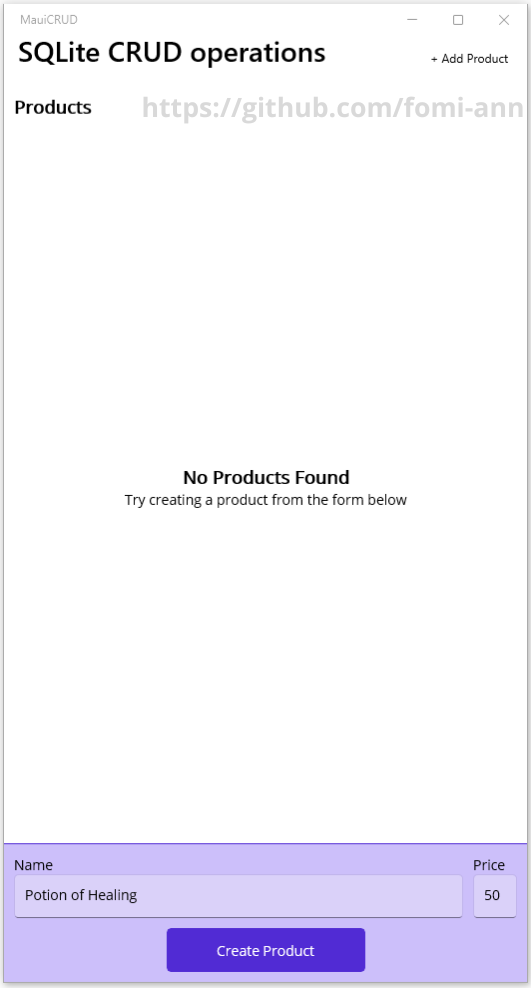
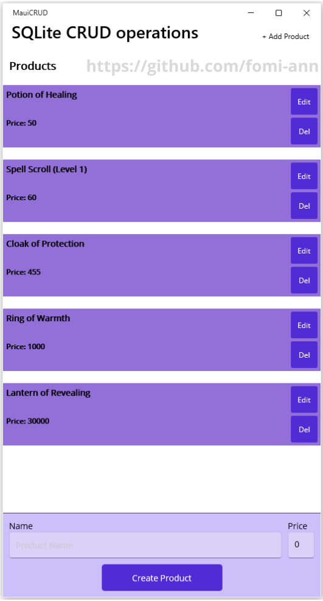
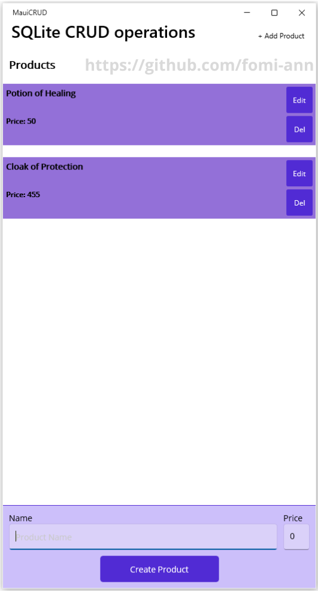

# MAUICRUD

A .NET MAUI application demonstrating CRUD (Create, Read, Update, Delete) operations on a list of products. All product data is stored in a local SQLite database, ensuring persistence across app sessions. This project is a learning/demo app for MAUI, XAML, MVVM, and basic database operations.


## Features
1. Display a list of products in a CollectionView
2. Display, Add, Edit and Delete products
3. Busy indicator while loading or processing
4. Uses MVVM architecture


## Screenshots

<table>
  <tr>
    <td><h3>Create/Add Product</h3></td>
    <td><h3>Product List</h3></td>
  </tr>
  <tr>
    <td>Displays a "No Products Found" message with an instruction to create an entry.</td>
    <td>Shows a scrollable list of items with their names and prices displayed on purple cards.</td>
  </tr>
  <tr>
    <td>
      <p align="center">
        
      </p>
    </td>
    <td>
      <p align="center">
        
      </p>
    </td>
  </tr>
  <tr>
    <td><h3>Edit/Update Product</h3></td>
    <td><h3>Edited/Updated Product</h3></td>
  </tr>
  <tr>
    <td>After clicking the "Edit" button, the selected item's details are loaded into the form for modification.</td>
    <td>After clicking the "Update Product" button, Item details are saved and updated in the Product List.</td>
  </tr>
  <tr>
    <td>
      <p align="center">
        
      </p>
    </td>
    <td>
      <p align="center">
        
      </p>
    </td>
  </tr>
  <tr>
      <td colspan="2"><h3>Delete Product</h3></td>
  </tr>
  <tr>
    <td colspan="2">Each product card includes a "Del" button, allowing for immediate removal of items from the SQLite database.</td>
  </tr>
  <tr>
    <td colspan="2">
      <p align="center">
        
      </p>
    </td>

  </tr>
</table>


## Tech Stack:
- Framework: .NET MAUI
- Pattern: MVVM (Model-View-ViewModel)
- Database: SQLite (Local storage)
- Language: C# / XAML


## Project Structure
```
MauiCRUD/
│
├─ Data/
│   └─ DatabaseContext.cs       # Database setup
│
├─ Models/
│   └─ Product.cs               # Product entity
│
├─ Platforms/
│   ├─ Android/
│   ├─ iOS/
│   ├─ MacCatalyst/
│   ├─ Tizen/
│   └─ Windows/
│
├─ Resources/
│   ├─ AppIcon/
│   ├─ Fonts/
│   ├─ Images/
│   ├─ Raw/
│   ├─ Splash/
│   └─ Styles/
│
├─ ViewModels/
│   └─ ProductsViewModel.cs     # MVVM commands & logic
│
├─ App.xaml                     # Global resources
├─ AppShell.xaml                # App navigation structure
├─ MainPage.xaml                # Main CRUD page
└─ MauiProgram.cs               # MAUI startup configuration
```


## Getting Started
Prerequisites:
- .NET 9 SDK
- Visual Studio 2022/2023 with MAUI workload installed


## Running the App
- Clone the repository: git clone https://github.com/fomi-ann/MauiCRUD.git
- Open the solution in Visual Studio.
- Select Windows Machine.
- Build and run the project (F5).
